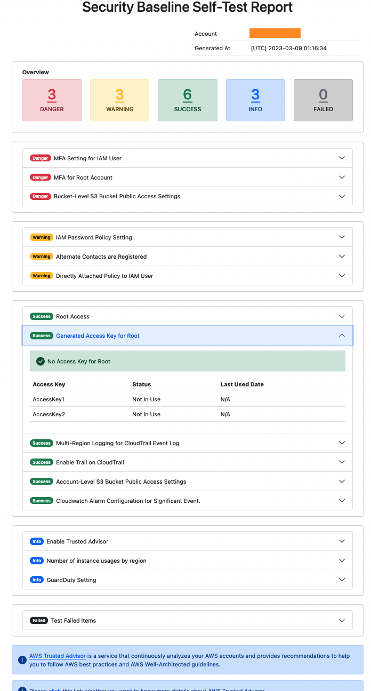
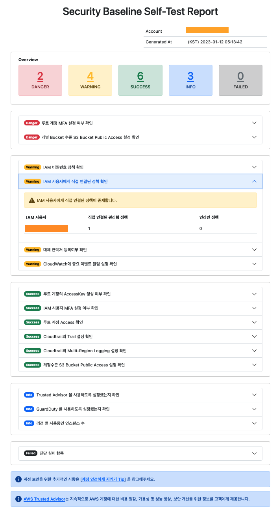

# Language
1. [English](#english)
2. [한국어](#korean)

<br>
<br>

# English
# What is a Security Baseline Self-Test Script?
> According to the [Shared Responsibility Model](https://aws.amazon.com/compliance/shared-responsibility-model/?nc1=h_ls), AWS and customers share the responsibility on security. AWS is responsible for protecting the infrastructure, such as software and hardware that executes all services offered on the cloud. On the other hand, customers have the responsibility to configure and manage the security upon using the AWS cloud services.<br><br>
> Security Baseline Self-Test Script is the `AWS script that carries out an assessment of the account set-up regarding basic security advisories and provides a report as a result.`
<br><br>
Users can simply run the script to perform a security check on their AWS accounts and see the results of 15 items, including AWS account security and workload security.

<br>

# Who needs this Script?
> Any AWS users who would like to get their accounts quickly assessed to see if they comply with basic security advisories will benefit from using this application. We would like to recommend this application especially to first-time AWS users or others who would like to implement their workloads on AWS.
<br>
On the test report, we are providing multiple ways to effectively respond to security threats on AWS with minimal resources. This makes even early-stage startups who cannot invest much resource on their security suitable for using this script. 

<br>

# How can I start this script?
### Tip) [Watch Video Guide](https://youtu.be/bc_jk8eES_I)
### [Prerequisites]

<br>

> - install python3
> - install git
> - install [AWS CLI](https://docs.aws.amazon.com/cli/latest/userguide/getting-started-install.html)

### [Create an IAM account with permissions]
<br>

> First, create an IAM user from the account you want to assess.
>
> 1. On the Console Home page, select the IAM service.
> 2. In the navigation pane, select Users and then select Add users.
> 3. On the Specify user details page, under User details, in User name, enter the name for the new user. This is their sign-in name for AWS.
> 4. On the Set permissions page, specify how you want to assign permissions for this user. Select one of the "Attach policies directly" option.
> 5. Select "Create Policy" and please copy and use the IAM user permission policy below on the JSON tab.
>
> Tip) The permissions of the IAM user below consist of read-only permissions, except for the permission to generate IAM Credential Reports to check the security settings of the Root Account and IAM User, so the script only performs diagnostics without changing the existing settings.<br> Detailed permission definitions are as follows and are defined in the file [permission.json](./permission.json).
```bash
{
    "Version": "2012-10-17",
    "Statement": [
        {
            "Sid": "SSBUserPermission",
            "Effect": "Allow",
            "Action": [
                "iam:GenerateCredentialReport",
                "s3:GetBucketPublicAccessBlock",
                "iam:GetAccountPasswordPolicy",
                "cloudtrail:GetTrail",
                "ec2:DescribeInstances",
                "guardduty:ListDetectors",
                "cloudtrail:GetTrailStatus",
                "account:GetAlternateContact",
                "ec2:DescribeRegions",
                "s3:ListBucket",
                "iam:ListUserPolicies",
                "support:DescribeTrustedAdvisorChecks",
                "guardduty:GetDetector",
                "cloudtrail:DescribeTrails",
                "s3:GetAccountPublicAccessBlock",
                "s3:ListAllMyBuckets",
                "ec2:DescribeNetworkInterfaces",
                "ec2:DescribeVpcs",
                "iam:ListAttachedUserPolicies",
                "cloudwatch:DescribeAlarms",
                "iam:ListUsers",
                "sts:GetCallerIdentity",
                "iam:GetCredentialReport",
                "ec2:DescribeSubnets"
            ],
            "Resource": "*"
        }
    ]
}
```
>
> Tip) When conducting an inspection using CloudShell, you need to additionally grant the AWSCloudShellFullAccess permission.
>
> 6. After creating the IAM policy, connect the created IAM policy to the IAM user, and click "Next" to complete user creation.
> 
> Once an IAM user is created, select the Security credentials tab on the IAM user details page and click "Create access key" to create an Access key. <br>[[Create IAM User Access Key](https://docs.aws.amazon.com/IAM/latest/UserGuide/id_credentials_access-keys.html#Using_CreateAccessKey)]
>
> [Set up the credentials file for the AWS CLI](https://docs.aws.amazon.com/cli/latest/userguide/cli-configure-files.html) in an environment where AWS CLI is installed.<br><br>
> Tip) AWS CloudShell allows you to use the AWS CLI directly.<br>
> To learn how to use AWS CloudShell, see [Getting Started with AWS CloudShell](https://docs.aws.amazon.com/cloudshell/latest/userguide/getting-started.html)

<br>

### [Configuring the Python Environment]
> First, download the script using the git clone command.
```bash
git clone https://github.com/aws-samples/security-baseline-self-test.git
```

> Run the command below to create a virtual environment to run the script.<br>
```bash
cd security-baseline-self-test
python3 -m venv ssb-env
```
> Once the virtual environment is created, run the command below to activate it.<br>
> 
> [windows]
```bash
ssb-env\Scripts\activate.bat
```
> [Unix or MacOS]
```bash
source ssb-env/bin/activate
```
> Once the virtual environment is activated, run the command below to install the package needed to run the script.<br>
```bash
cd sst
python -m pip install -r requirements.txt
```

### [Run Script]
> Run run_script.py in the [sst](./sst) directory of the downloaded script.
```bash
python3 run_script.py
```
> If you specified the profile name when setting up the credential file in the AWS CLI, you can also run the script by putting the profile name as an executor as shown below.
```bash
python3 run_script.py [--profile PROFILE] [--language ENG/KOR/JPN]
```
> Currently, English, Korean and Japaness are supported.<br>
> When the assessment is completed, see the results report in html format generated within the results directory.
>
> If you ran the check in AWS CloudShell, you'll need to download and view the resulting report.<br>
You can learn how to download files from AWS CloudShell [here](https://docs.aws.amazon.com/cloudshell/latest/userguide/getting-started.html#download-file).

### [ Report Sample ]

> <br><br>

### [ User Survey ]

> We're constantly improving the Security Baseline Self-test with user's feedback. Please share what you like, don't like, or have ideas for improvement in the survey below, and we'll make sure to bring you better content in the future.
>
> [(English) Survey Link](https://pulse.buildon.aws/survey/SECBHHHT)

# FAQ
> *- What can be done to test more items in order to further improve the security?*<br>
> If you want to test the security of more AWS accounts, using the [AWS Trusted Advisor](https://aws.amazon.com/blogs/aws/aws-trusted-advisor-new-priority-capability/) would be a good choice. The AWS Trusted Advisor is a service that analyzes your AWS accounts regularly, and help you follow the AWS security best practices and Well-Architected framework. If you manage your security items through AWS Trusted Advisor, you can improve the security of your AWS accounts. 
>
> <br>
>
> *- Where can I find additional information or guidelines on how to improve the AWS security level?*<br>
> AWS is providing the [AWS Well-Architected Tool](https://docs.aws.amazon.com/wellarchitected/latest/userguide/intro.html), a service in the cloud that provides a consistent process for measuring customers’ architectures using AWS best practices. If you need additional information or guidelines to enhance your security level, you can refer to security best practices on AWS Well Architected Tool’s Security pillar for architecture design and diagnosis. 
>
> <br>
>
> *- Can I scan other accounts in the same AWS Organization at once?*<br>
> This script only supports scanning for a single AWS account. Therefore, if you want to scan other AWS accounts that are linked of the same AWS Organization, you must create another IAM user on those AWS accounts. Also, AWS Organization-level security settings cannot be scanned through this script.
>
> <br>
>
> *- Is there a way to run this script without using an IAM Access Key?*<br>
> After the 01/Aug/2023 update, you can check using IAM Role.<br> Please refer to [Overview of using IAM roles](https://docs.aws.amazon.com/cli/latest/userguide/cli-configure-role.html#cli-role-overview) to add profile information, and then run the script by adding *profile* as an option as shown below.
> ```bash
> python3 run_script.py [--profile PROFILE] [--language ENG/KOR/JPN]
> ```

<br><br><br>
# Korean
# What is a Security Baseline Self-Test Script?
> [공동 책임 모델](https://aws.amazon.com/ko/compliance/shared-responsibility-model/?nc1=h_ls)에 따라 AWS와 고객은 클라우드 보안에 대한 공동의 책임을 지닙니다. AWS는 클라우드에서 제공되는 모든 서비스를 실행하는 소프트웨어와 하드웨어를 포함한 인프라를 보호할 책임이 있습니다. 반면 고객은 이용하는 AWS 클라우드 서비스에서의 보안을 구성하고 관리할 책임을 가집니다.<br><br>
> Security Baseline Self-Test Script은 사용중인 `AWS 계정의 가장 기본적인 보안권고 사항에 대한 설정을 점검`하고, 그 `결과를 리포트로 제공`하는 Script 입니다.
<br><br>
사용자는 Script를 실행시켜 간단하게 AWS 계정에 대한 보안 점검을 진행할 수 있으며, AWS 계정 보안과 워크로드 보안 등 15가지 항목들의 점검 결과를 확인하실 수 있습니다.

<br>

# Who needs this Script?
> 자신이 현재 사용하는 AWS 계정에 대한 보안권고 준수 상황을 간단하게 점검하고 싶은 사용자라면 누구나 사용하실 수 있습니다. 특히 AWS 를 처음 사용하는 분이나, 자신의 워크로드를 AWS 에서 구현하고 싶은 분에게 사용을 추천드립니다. 
<br><br>
또한 점검 리포트에는 적은 리소스로 AWS 보안 위협에 효과적으로 대처할 수 있는 방법들에 대해서도 안내하고 있으니, 보안에 많은 리소스를 투자하기 어려운 초기 스타트업에서도 이 Script 을 활용할 수 있습니다.

<br>

# How can I start this script?
### Tip) [동영상 가이드 보기](https://youtu.be/bc_jk8eES_I)

### [ 사전 준비 ]

<br>

> - python3 설치
> - git 설치
> - [AWS CLI](https://docs.aws.amazon.com/cli/latest/userguide/getting-started-install.html) 설치

### [점검 권한을 가진 IAM 계정 생성]
<br>

> 먼저 점검을 하고자 하는 계정에서 아래의 순서대로 IAM 사용자를 생성합니다.
> 
> 1. 먼저 AWS Management Console 에서 IAM Console을 엽니다.
> 2. 탐색 창에서 사용자(Users)와 사용자 추가(Add users)를 차례로 선택합니다.
> 3. 신규 사용자의 사용자 이름을 입력합니다. 이것은 AWS에 로그인할 때 사용하는 이름입니다.
> 4. 다음: 권한(Next: Permissions)를 선택한 뒤, 권한 설정 페이지에서 "기존 정책을 직접 연결합니다." 옵션을 선택합니다.
> 5. "정책 생성"을 선택한 다음, 정책은 "JSON" 탭을 선택하고, 아래의 IAM 사용자 권한 정책을 복사해서 사용해주세요.
>
> Tip) 아래의 IAM 사용자의 권한은 Root Account와 IAM User의 보안설정을 점검하기 위한 IAM Credential Report를 생성하는 권한 외에는 모두 읽기전용 권한으로 구성되어 있어 기존의 설정을 변경하지 않고 진단만 수행합니다. <br> 자세한 권한 정의는 아래와 같고, [permission.json](./permission.json) 파일에 정의되어 있습니다.
```bash
{
    "Version": "2012-10-17",
    "Statement": [
        {
            "Sid": "SSBUserPermission",
            "Effect": "Allow",
            "Action": [
                "iam:GenerateCredentialReport",
                "s3:GetBucketPublicAccessBlock",
                "iam:GetAccountPasswordPolicy",
                "cloudtrail:GetTrail",
                "ec2:DescribeInstances",
                "guardduty:ListDetectors",
                "cloudtrail:GetTrailStatus",
                "account:GetAlternateContact",
                "ec2:DescribeRegions",
                "s3:ListBucket",
                "iam:ListUserPolicies",
                "support:DescribeTrustedAdvisorChecks",
                "guardduty:GetDetector",
                "cloudtrail:DescribeTrails",
                "s3:GetAccountPublicAccessBlock",
                "s3:ListAllMyBuckets",
                "ec2:DescribeNetworkInterfaces",
                "ec2:DescribeVpcs",
                "iam:ListAttachedUserPolicies",
                "cloudwatch:DescribeAlarms",
                "iam:ListUsers",
                "sts:GetCallerIdentity",
                "iam:GetCredentialReport",
                "ec2:DescribeSubnets"
            ],
            "Resource": "*"
        }
    ]
}
```
>
> Tip) Cloudshell을 사용해서 점검을 진행하는 경우, 추가로 **AWSCloudShellFullAccess** 권한을 부여해야 합니다.
>
> 6. IAM 정책 생성 후, 생성한 IAM 정책을 IAM 사용자에게 연결해주고, 계속 "다음"을 눌러 사용자 생성을 완료해주세요.
> 
> IAM 사용자가 생성되면 해당 IAM 사용자 상세정보 페이지에서 Security credentials 탭을 선택하고 "Create access key"를 눌러 Access key를 만들어주세요. <br>[[IAM 사용자 Access Key 생성](https://docs.aws.amazon.com/ko_kr/IAM/latest/UserGuide/id_credentials_access-keys.html#Using_CreateAccessKey)]
>
> AWS CLI가 설치된 환경에서 [AWS CLI의 자격 증명 파일을 설정](https://docs.aws.amazon.com/ko_kr/cli/latest/userguide/cli-configure-files.html)해주시기 바랍니다.<br><br>
> Tip) AWS CloudShell에서는 AWS CLI를 바로 사용하실 수 있습니다.<br>
> AWS CloudShell 사용 방법은 [AWS CloudShell 시작하기](https://docs.aws.amazon.com/ko_kr/cloudshell/latest/userguide/getting-started.html)를 참고하시기 바랍니다.

<br>

### [Python 실행환경 구성]
> 먼저 git clone 명령을 사용하여 스크립트를 다운로드 받아주세요.
```bash
git clone https://github.com/aws-samples/security-baseline-self-test.git
```

> 아래 명령어를 실행하여 스크립트를 실행할 가상 환경을 만들어주세요.<br>
```bash
cd security-baseline-self-test
python3 -m venv ssb-env
```
> 가상환경이 생성되면, 아래의 명령을 실행하여 가상환경을 활성화해주시기 바랍니다.<br>
> 
> [windows]
```bash
ssb-env\Scripts\activate.bat
```
> [Unix 또는 MacOS]
```bash
source ssb-env/bin/activate
```
> 가상환경이 활성화되면 아래의 명령을 실행하여 스크립트 실행에 필요한 패키지를 설치해주시기 바랍니다.<br>
```bash
cd sst
python -m pip install -r requirements.txt
```

### [스크립트 실행]
> 다운받은 스크립트의 [sst](./sst) 디랙토리 내의 run_script.py 를 실행합니다.
```bash
python3 run_script.py
```
> AWS CLI의 자격 증명 파일 설정시 프로파일 명을 지정했다면, 해당 프로파일명을 아래와 같이 실행인자로 넣어 스크립트를 실행할 수도 있습니다.
```bash
python3 run_script.py [--profile PROFILE] [--language ENG/KOR/JPN]
```
> 현재 영어와 한국어, 일본어를 지원합니다.<br>
> 점검이 끝나면 results 디렉토리 내에 생성된 html 형식의 결과 리포트를 확인합니다.
>
> 만약 AWS CloudShell에서 점검을 진행한 경우, 결과 리포트를 다운로드한 뒤 확인해야 합니다.<br>
> AWS CloudShell에서 파일을 다운로드하는 방법은 [여기](https://docs.aws.amazon.com/ko_kr/cloudshell/latest/userguide/getting-started.html#download-file)를 참고하시기 바랍니다.

### [ Report Sample ]

> <br><br>


### [사용자 의견]

> Security Baseline Self-test는 사용자의 의견을 받아 지속적으로 개선이 이루어지고 있습니다. 사용하시면서 좋았던 점과 불편했던 점 또는 개선을 위한 아이디어를 아래 설문조사를 통해 공유해주시면 향후 더 발전된 컨텐츠를 제공해드리겠습니다.
>
> [(한국어) Survey Link](https://pulse.buildon.aws/survey/ZBSAR85T)
> 
> 점검 결과와 관련하여 추가 문의가 있거나 보안 개선에 전문가의 도움이 필요한 경우, 점검 결과 파일과 문의사항을 아래 한국 AWS 스타트업 팀 보안 이벤트 메일을 통해 전달해 주세요. 확인 후 도움을 드리도록 하겠습니다.
>
> AWS 한국 스타트업 팀 보안 이벤트 메일 : aws-kr-ssb@amazon.com

# FAQ
> *- 보안 수준을 향상시키기 위해 더 많은 항목을 점검하려면 어떻게 해야 하나요?*<br>
> 더 많은 AWS 계정의 보안 설정을 점검하시고 싶은 경우 [AWS Trusted Advisor](https://aws.amazon.com/ko/blogs/korea/aws-trusted-advisor-new-priority-capability/) 를 사용하시면 좋습니다. AWS Trusted Advisors는 AWS 계정을 지속적으로 분석하고 AWS 보안 모범 사례 및 AWS Well-Architected 가이드라인을 따르는데 도움이 되는 서비스입니다. 따라서 AWS Trusted Advisor 를 통해 Security 진단 항목을 관리하시면 AWS 계정의 보안 수준을 향상시킬 수 있습니다.
>
> <br>
>
> *- AWS 보안 수준을 향상시키기 위한 추가 정보나 가이드라인을 알고 싶은 경우 어떻게 하면 좋을까요?*<br>
> AWS 에서는 AWS 모범사례를 사용하여 아키텍처를 측정하기 위한 일관된 프로세스를 제공하는 클라우드 서비스로 [AWS Well-Architected Tool](https://docs.aws.amazon.com/ko_kr/wellarchitected/latest/userguide/intro.html) 을 제공하고 있습니다. 보안 수준을 향상시키기 위한 추가 정보나 가이드라인이 필요하신 경우 AWS Well Architected Tool 의 Security pillar 를 기반으로 보안 모범사례를 참고하여 아키텍처 설계 및 진단을 하실 수 있습니다.
>
> <br>
>
> *- 동일한 AWS Organization에 속한 다른 계정도 한번에 검사가 가능한가요?*<br>
> 이 스크립트는 단일 AWS 계정에 대한 검사만 지원합니다. 따라서 동일한 AWS Organization에 속해있는 다른 AWS 계정을 검사하고 싶은 경우에는 해당 AWS 계정에서 별도의 IAM 계정을 생성해야 합니다. 또한 AWS Organization 수준의 보안 설정은 본 스크립트를 통해 검사가 불가능합니다.
>
> <br>
>
> *- IAM Access Key를 사용하지 않고 점검하는 방법은 없나요?*<br>
> 2023-Aug-01 업데이트 이후 IAM Role 을 이용한 점검이 가능합니다.
> [AWS CLI에서 IAM 역할 사용](https://docs.aws.amazon.com/ko_kr/cli/latest/userguide/cli-configure-role.html#cli-role-overview)을 참고하여 profile 정보를 추가하신 다음, 스크립트 실행 시 *profile* 을 옵션을 아래와 같이 추가하여 실행하세요.
> ```bash
> python3 run_script.py [--profile PROFILE] [--language ENG/KOR/JPN]
> ```

