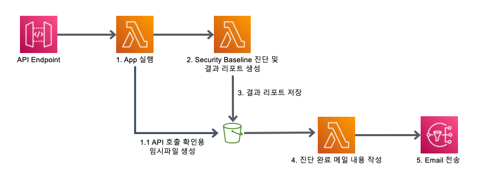
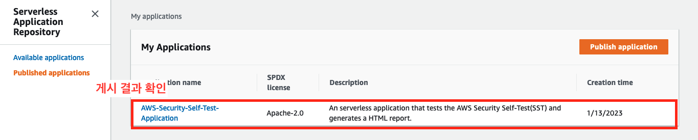
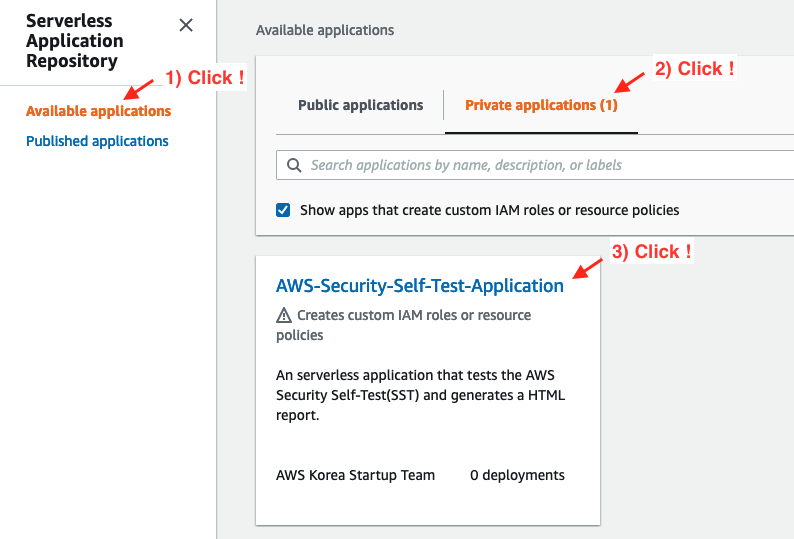
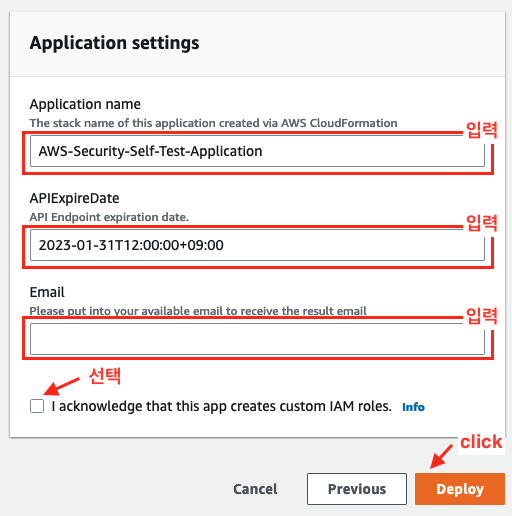
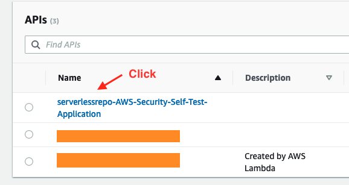
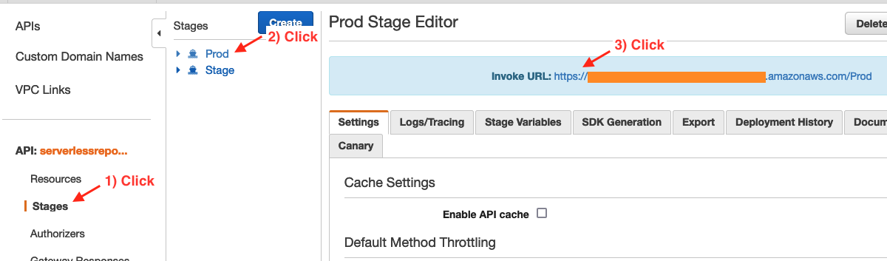
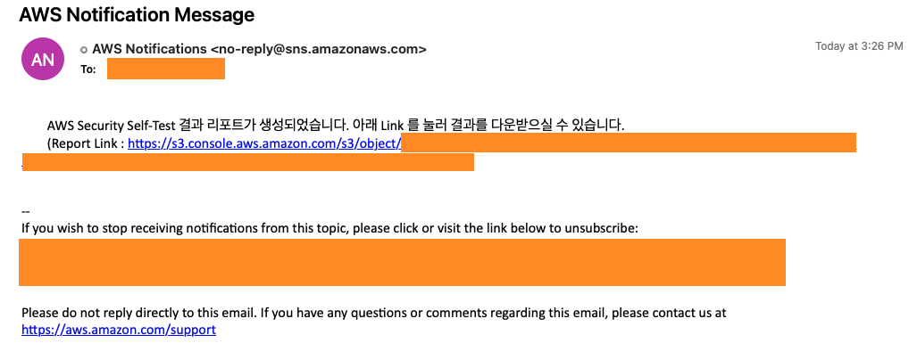

# What is a Security Baseline Self-Test application?
> [공동 책임 모델](https://aws.amazon.com/ko/compliance/shared-responsibility-model/?nc1=h_ls)에 따라 AWS와 고객은 클라우드 보안에 대한 공동의 책임을 지닙니다. AWS는 클라우드에서 제공되는 모든 서비스를 실행하는 소프트웨어와 하드웨어를 포함한 인프라를 보호할 책임이 있습니다. 반면 고객은 이용하는 AWS 클라우드 서비스에서의 보안을 구성하고 관리할 책임을 가집니다.<br><br>
> Security Baseline Self-Test Application 은 사용중인 `AWS 계정의 가장 기본적인 보안권고 사항에 대한 설정을 점검`하고, 그 `결과를 리포트로 제공`하는 AWS Sample Application 입니다.
<br><br>
이 Application 은 복잡한 아키텍처 구성이나 개발과정을 사용자가 직접 할 필요 없이 사전에 작성된 템플릿을 이용하여 계정에 자동으로 AWS 리소스를 생성하고 생성된 자원에 파이썬 코드를 자동으로 배포합니다.
<br><br>
사용자는 Application 에서 제공하는 API Endpoint 를 호출함으로써 간단하게 점검을 진행할 수 있으며, AWS 계정 보안과 워크로드 보안 등 15가지 항목들의 점검 결과를 확인하실 수 있습니다.

<br>

# Who needs this application?
> 자신이 현재 사용하는 AWS 계정에 대한 보안권고 준수 상황을 간단하게 점검하고 싶은 고객이라면 누구나 사용하실 수 있습니다. 특히 AWS 를 처음 사용하는 분이나, 자신의 워크로드를 AWS 에서 구현하고 싶은 분에게 사용을 추천드립니다. 
<br><br>
또한 점검 리포트에는 적은 리소스로 AWS 보안 위협에 효과적으로 대처할 수 있는 방법들에 대해서도 안내하고 있으니, 보안에 많은 리소스를 투자하기 어려운 초기 스타트업에서도 이 Application 을 활용할 수 있습니다.

<br>

# How it works?

> ### [ Architecture ]<br>
> 
>
> Security Baseline Self-Test Application 은 다음과 같은 AWS Resource 를 자동으로 생성합니다.
> 
> - Amazon API Gateway
> - AWS Lambda Function 3개
> - Amazon S3 Bucket
> - Amazon Simple Notification Service (Amazon SNS)
>
> Amazon API Gateway 는 퍼블릭으로 배포된 API Endpoint URL 을 제공하며, 고객은 해당 URL 로 접속하여 계정에 대한 보안 자가진단을 시작할 수 있습니다. 
<br><br>이 API Endpoint URL 은 점검을 요청하는 용도로만 사용되며, 점검 결과는 Amazon S3 Bucket 에 저장되어 권한있는 사용자가 AWS Management Console 에 로그인해야만 확인이 가능합니다. 파일이 저장된 Bucket URL 은 결과 메일에서 확인이 가능합니다.
<br><br>
>API Gateway 의 Endpoint URL 호출은 보안 점검을 수행하는 AWS Lambda Function 을 차례로 호출합니다. 3개의 AWS Lambda Function 은 각각 차례로 <br>
>
> 1. 사전 환경구성 확인 및 요청 유효성 검증, <br>
> 2. 계정에 대한 보안 점검 및 리포트 생성, <br>
> 3. 점검완료 알림메일 발송 기능을 순차적으로 실행합니다. 
> 
> Amazon S3 Bucket 은 점검결과에 대한 리포트가 저장되며, Amazon SNS 는 점검완료 알림메일을 고객에게 발송합니다.
> <br>
AWS Resource 설정 정보에 대한 자세한 정보는 template.yaml 파일에서 확인하실 수 있습니다.

<br>

# How can I start this application?

### [ 사전 준비 ]

<br>

> - Application 배포가 가능한 AWS Account
> - Application 을 계정에 배포할 수 있는 권한을 가진 IAM Entity (IAM User, IAM Role 등)
> - [AWS CLI](https://docs.aws.amazon.com/cli/latest/userguide/getting-started-install.html) 설치 및 구성
> - [AWS Serverless Application Model CLI](https://docs.aws.amazon.com/serverless-application-model/latest/developerguide/serverless-sam-cli-install.html) (AWS SAM CLI) 설치
> - Application Package 가 업로드 될 S3 Bucket 생성 및 권한 설정. 자세한 권한은 아래 [S3 Bucket Policy] 참고

<br>

#### [ S3 Bucket Policy ]
```json
{
    "Version": "2012-10-17",
    "Statement": [
        {
            "Effect": "Allow",
            "Principal": {
                "Service": "serverlessrepo.amazonaws.com"
            },
            "Action": "s3:GetObject",
            "Resource": "arn:aws:s3:::{BucketName}/*",
            "Condition": {
                "StringEquals": {
                    "aws:SourceAccount": "{AccountID - 12 Digit}"
                }
            }
        }
    ]
}
```

<br>

### [ Package ]
> Package 는 본 Application 의 코드, README, License 파일 등을 AWS S3 Bucket 으로 업로드하고, template.yaml 파일을 참고하여 Application 에서 필요한 리소스를 생성할 yaml 파일을 생성합니다. Package 과정에서 생성된 packaged.yaml 파일은 CloudFormation 에서 사용할 수 있습니다.
> 
> AWS SAM CLI 를 이용하는 경우 아래의 명령어를 통해 package 를 진행해주시기 바랍니다.


```bash
sam package \
 --template-file template.yaml \
 --output-template-file packaged.yaml \
 --s3-bucket {S3 bucket name} \
```


> package가 정상적으로 생성되지 않을 경우, `--force-upload` 옵션을 명령에 추가해주세요.
> 
> 만약, 처음으로 application을 publish 를 하는 경우가 아닌 기존의 application 을 업데이트하고자 하는 경우에는 template.yaml의 Metadata 에서 SemanticVersion을 변경한 후 다시 진행하시면 됩니다.

<br>

### [ Publish ]

> Publish 는 Package 된 Application 을 Serverless Application Repository에 게시하는 과정이며, 아래와 같이 두가지 방법으로 배포하실 수 있습니다.<br>
<br>
 *방법 1) AWS SAM CLI*
>
> 명령줄에서 아래 명령어를 입력해주세요.


```bash
sam publish --template packaged.yaml
```


> `--region ap-northeast-2` 와 같은 옵션을 추가하는 경우, 게시되는 리전을 특정할 수 있습니다.<br>
> <br>
> *방법 2) AWS Management Console*
> 
> Serverless Application Repository의 [내 애플리케이션](https://ap-northeast-2.console.aws.amazon.com/serverlessrepo/home?region=ap-northeast-2#/published-applications)에서 Publish Application 버튼을 누른 뒤 packaged.yaml 파일을 업로드 해주세요.

<br>

### [ Deploy ]

> Deploy 는 Serveless Application Repository에 게시된 것을 계정에 배포하는 과정입니다. Publish 과정이후 [Serverless Application Repository management console](https://console.aws.amazon.com/serverlessrepo/home) 에 접속하시면 게시된 Application 을 확인하실 수 있습니다.<br><br>
<br><br>
해당 콘솔 왼쪽 메뉴에서 `Available application`을 선택하여 페이지를 이동하신다음 페이지의 상단 탭에서 `Private applications` 를 선택하면 게시된 application 을 확인하실 수 있습니다.<br><br>
<br><br>
Application 을 선택하고 `API 만료일`, `점검 완료 알림을 받을 Email 주소` 등 간단한 `Application Settings` 항목을 기입한 뒤 `Deploy` 를 진행하시면 Application 이 계정에 배포됩니다. 이 과정은 5분 ~ 10분 정도 시간이 걸릴 수 있습니다.<br><br>
<br><br>

<br>

### [ Run Application ]

> 배포가 완료되면 [Amazon API Gateway Management Console](https://ap-northeast-2.console.aws.amazon.com/apigateway/home?region=ap-northeast-2) 의 API 목록에서 배포 완료된 application 의 API 를 확인하실 수 있습니다. 배포 과정에서 application 의 이름을 변경한 경우 아래 이미지와 다르게 보일 수 있습니다.<br><br>
<br><br>
API 를 선택한 뒤 왼쪽 메뉴에서 `Stages` 메뉴를 선택하고 Prod Stage 를 선택하면 Prod Stage Editor 화면과 함께 `Invoke URL` 을 확인하실 수 있습니다. `Invoke URL` 을 클릭하시면 application 이 실행됩니다. <br><br>_<U>`이 URL 이 외부에 노출되는 경우 불필요한 추가비용이 발생할 수 있으니 안전하게 관리해주세요.`</U>_<br><br>
<br><br>

### [ Result Email Sample ]
> <br><br>

### [ Report Sample ]

> <br><br>

# FAQ
> *- Application 유지 비용이 발생하나요?*<br>
`Application 을 사용하지 않는다면 유지 비용은 발생하지 않습니다.` 또한 매일 한번씩 한달간 점검을 진행한다고 가정할 때, $0.1 이하의 비용이 발생할 것으로 예상됩니다. 단, S3 Bucket 에 저장하는 데이터의 용량이 많아질 경우 추가적인 비용이 발생할 수 있습니다.
>
> <br>
> 
> *- API Gateway 의 Endpoint URL은 외부에서 호출이 가능한가요?*<br>
> 네. Endpoint URL 은 외부에서 호출이 가능합니다. <br><br> 그러나 점검 결과는 S3 Bucket 에 저장되며, 점검 결과 리포트를 확인하기 위해서는 권한이 있는 사용자가 S3 Bucket의 Object를 다운로드 받아야합니다. 따라서 외부에서 Endpoint URL 을 호출하더라도 점검 결과 리포트는 외부로 전달되지 않습니다. <br><br> 하지만 외부에서 Endpoint URL 을 호출하는 경우 불필요한 추가 비용이 발생할 수 있으므로 `Endpoint URL 을 안전하게 관리해주시기 바랍니다.` 
>
> <br>
>
> *- 보안 수준을 향상시키기 위해 더 많은 항목을 점검하려면 어떻게 해야 하나요?*<br>
> 더 많은 AWS 계정의 보안 설정을 점검하시고 싶은 경우 [AWS Trusted Advisor](https://aws.amazon.com/ko/blogs/korea/aws-trusted-advisor-new-priority-capability/) 를 사용하시면 좋습니다. AWS Trusted Advisors는 AWS 계정을 지속적으로 분석하고 AWS 보안 모범 사례 및 AWS Well-Architected 가이드라인을 따르는데 도움이 되는 서비스입니다. 따라서 AWS Trusted Advisor 를 통해 Security 진단 항목을 관리하시면 AWS 계정의 보안 수준을 향상시킬 수 있습니다.
>
> <br>
>
> *- AWS 보안 수준을 향상시키기 위한 추가 정보나 가이드라인을 알고 싶은 경우 어떻게 하면 좋을까요?*<br>
> AWS 에서는 AWS 모범사례를 사용하여 아키텍처를 측정하기 위한 일관된 프로세스를 제공하는 클라우드 서비스로 [AWS Well-Architected Tool](https://docs.aws.amazon.com/ko_kr/wellarchitected/latest/userguide/intro.html) 을 제공하고 있습니다. 보안 수준을 향상시키기 위한 추가 정보나 가이드라인이 필요하신 경우 AWS Well Architected Tool 의 Security pillar 를 기반으로 보안 모범사례를 참고하여 아키텍처 설계 및 진단을 하실 수 있습니다.
>
><br>
>
> *- 이 Application 을 삭제하려면 어떻게 해야하나요?*<br>
> AWS Lambda Management Console 에서 Applications > "serverlessrepo-AWS-Security-Self-Test-Application" 선택 > 우측 상단의 "Actions" 에서 "Delete" 를 누른 다음 알림창의 안내대로 삭제를 진행하시면 됩니다.